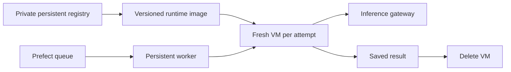

# Gardener startup and worker placement

Initial measurements on 2026-10-08, before production moved from bootstrap to
images. The [subsequent rollout](../archive/2026-10-08-gardener-images.md) preserves
the worker's location and each deployment's original wheel.

## Separate the decisions



The worker's location controls availability and dependencies. Preparing the
runtime image controls repeated installation. Reusing a job machine controls
isolation. Changing one does not require changing the others.

The worker currently runs on heavypad and issues/revokes grants directly in
the inference gateway's local SQLite database. Moving only the worker to exe.dev
would require a remote grant interface and would still depend on heavypad's
gateway. Moving both is a separate migration with grant-state durability,
network access, and restart/reconciliation checks.

## Repeated work

Bootstrap uses `uv sync --python 3.13.7`; uv manages the interpreter. There is
no separate manual Python installation. A new VM can still need dependency
resolution/downloads, and `prepare_pi_runtime()` runs apt and installs pinned
Node/Pi when its marker is absent.

The image builds the locked environment and prepares agent tools once. Image
mode verifies imports and links to the baked environment; it rejects runtime
requirements or wheel installation.

The initial live image probe found that the image lacked D-Bus: systemd was
PID 1, but the worker's unprivileged `systemctl show` failed with "Failed to
connect to bus". The Dockerfile now includes `dbus`.

## Measurements

| Stage | Current investigation wheel, bootstrap | Prepared image plus D-Bus |
| --- | ---: | ---: |
| First VM creation | 9.7 s | 17.7 s |
| Environment preparation | 8.8 s | 2.4 s |
| Agent-tool preparation | 24.8 s | 1.7 s |
| Repeated identical install | 0.9 s | 0.7 s |
| Supervisor start | 0.8 s | 0.8 s |
| Second VM creation | not timed | 3.0 s |
| Cancellation | 0.7 s | 0.7 s |

Both passed lifecycle checks and deleted both VMs. The first unmodified image
took 24.9 s to create, then failed the D-Bus check before executing a job; its VM
was also deleted.

These are individual live samples, not latency percentiles or a controlled
throughput benchmark. Bootstrap used investigation's pinned `aea6340` wheel;
the image used `629e9ba` plus D-Bus. The trial shares capacity, and the initial
image transfer overlapped part of the bootstrap measurement. The useful result
is that the image skips installation, not a promised end-to-end speedup. Startup
still includes image availability, network round trips, and interpreter imports.

A full rebuild from the corrected Dockerfile also passed: first creation 23.8 s,
environment preparation 2.3 s, agent tools 1.6 s, second creation 2.9 s,
cancellation 0.6 s. This used current `d7af76a` source plus the D-Bus change;
the local image is `gardener:startup-verified`. The temporary registry and all
probe VMs were deleted after verification. No permanent registry was provisioned.

## Reproduce

The probe creates two disposable VMs, checks detached-child cleanup, preserved
outcomes after supervisor restart, cancellation, and verified VM deletion.

```sh
just gardener-probe --local-package /path/to/mps.whl --prepare-agent
just gardener-probe --image REGISTRY/IMAGE:REVISION --prepare-agent
```

Use the deployment's wheel for the bootstrap measurement. An empty-environment
probe does not measure application startup. Stage times include SSH round trips;
the printed bootstrap-stage breakdown measures commands inside the VM.

## Direction

First make the prepared image available through a durable private registry and
canary one deployment. Keep the wheel/image revision explicit: the existing
deployments pin different application revisions, so a shared new image also
changes their code. Validate a real investigation before switching defaults.

Keep separate job VMs as the default. If creation latency remains material,
measure a small reserve of unused VMs, consuming each once and deleting it after
the task. Do not clone a VM that contains a previous job's grant or workspace.
Use a shared hot machine only for explicitly trusted workloads with suitable
concurrency and cleanup boundaries.

exe.dev supports custom images and VM copying. Private registry boot pulls
happen on the host before the VM exists and need `--registry-auth`; integrations
inside a running VM do not authenticate that pull. The benchmark uses a temporary
private registry VM through exe.dev's documented same-account pull mechanism.

The account's live plan reports a trial ending October 11, 2026, with 2 vCPUs
and 8 GB shared across VMs. More VMs do not imply more compute capacity.

References: [exe.dev private images](https://exe.dev/docs/private-image),
[uv Docker guidance](https://docs.astral.sh/uv/guides/integration/docker/).
